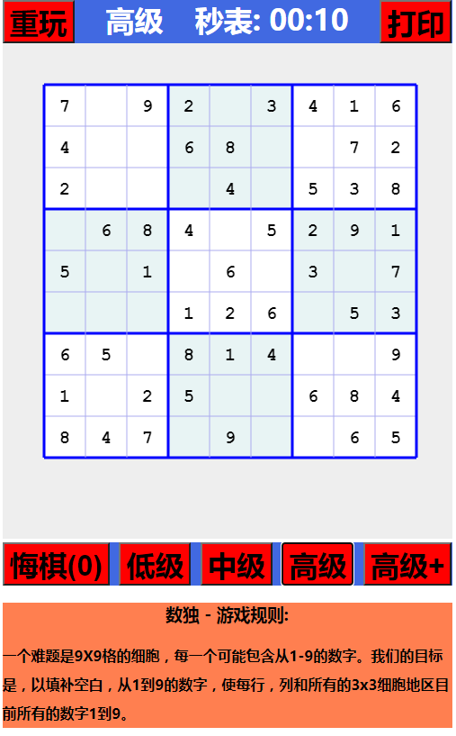

# 前端实现数独
# 演示地址
<a href ="https://yanglinyun.github.io/sudoku/">https://yanglinyun.github.io/sudoku/</a>

# 實現效果UI

# 使用技術: HTML5\CSS3\JS
# 第三方库: Jquery
# 兼容性: chrome\edge\safari\firefox 移动端百分比响应式
# 简介:
1. 使用前端cavas技术绘制 9X9 标准数独棋盘、棋子
2. 使用js实现走棋规则
# 具体功能:
1. 实现简单,中级,高级,高级+ 4种难度玩法
2. 采用平均0.75s快速随机生成不同难度的数独棋局 与 快速的检测输入冲突的算法，优化玩家体验
3. 使用二维数组存储地图,从当前下子的位置向同列、行、所在宫内进行检索,若存在相同元素则 产生冲突 无法输入
4. 产生冲突 无法输入时高亮并闪动2次冲突元素,提示玩家
4. 记谱功能实现
5. 使用对象深拷贝实现可悔棋5步
6. 重玩
7. 游戏时间记录
7. 打印生成的棋盘,可保存、打印离线玩

